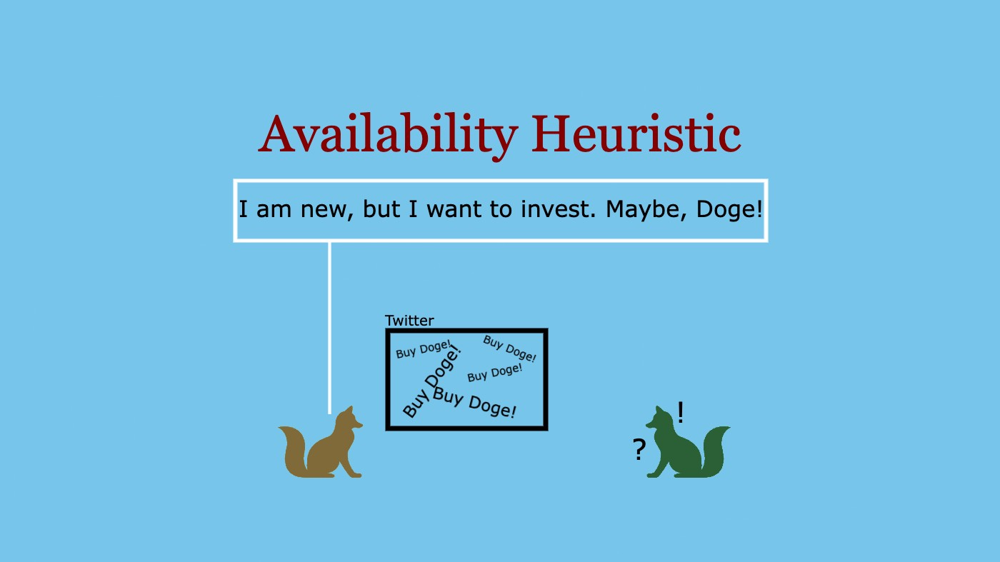

👋🏼 Hello! Thank you for stopping by!

😀 Please note that this is the fourth in a series of articles I am writing on Cognitive Biases. If you haven’t read the other three yet, I’d recommend you read them first. **Links below:**

1. [Confirmation Bias](/p/confirmation-bias) ✅
2. [Fundamental Attribution Error](/p/fundamental-attribution-error) ✅
3. [Ikea effect](/p/ikea-effect) ✅
---

Let’s get started with this one.

## The geyser story
Last year, we moved into our newly built house in Hyderabad. Nothing fancy, just a decent one with a few more comforts compared to the old house. For one, the new house had a facility for geyser whereas the old one didn’t.

One of my school friends, Naresh, visited us when we were getting the geysers fitted. We had ordered Havells geysers from Amazon. They seemed fine, the power rating, the warranty, the make of the product and the price — they fit our requirement.

What amazed me was what happened after that. When Naresh wanted to buy geysers for his home, he too ordered the ‘Havells geysers from Amazon’. They performed well and were energy efficient, after all, and it made sense to order the same product he thought. All he did was, he searched for Havells geysers on Amazon, placed the order and they got delivered. Only, there was one problem — **the geyser did not fit the height in his bathroom!** He did not check that, the geyser did not fit his requirements. And he had to replace it!

So, what happened here? Naresh was presented with a similar situation as I. He just reproduced what I did as if it was the natural thing to do. In fact, it sounds fairly simple too — When I wanted to have a geyser, I ordered a Havells from Amazon and when Naresh wanted to have a geyser, he too ordered a Havells from Amazon, because it worked for me. He took my geyser as an example and applied it in his judgement!

I realised, when we are in a situation where we are supposed to decide if something works or not, we most often think of the situations in the past and identify what had worked already and reproduce the same. Seems like a fully scientific approach, right? We are using historic data to predict what needs to be done in the future. However, there is one catch. A big one.

You see, we, humans, are not computers. Our ability to recollect data and information and process it is limited. We do not see the entire context as clearly. Our natural tendency is to process only that information that is very vivid in our mind. And whatever is vivid doesn’t necessarily mean that it is sufficient and that could lead to some potential errors. So, it requires quite an additional effort to actually process the information in its entirety to avoid errors. But, as you know, our brain is lazy to do that.

Speaking in statistical terms, the sample size or the number of data points we could recollect and process at a time is very minimal. Though the capacity of our brain is unbelievably large, it is just not a natural thing for us to process such larger portions in a very short span of time. Because our life demands us to make decisions all the time, we tend to use the references which are very fresh in our memory to arrive at decisions rather quickly. And if we make the decisions based on the ‘notions’ derived from such a small sample (of memories), we are prone to what is called a **Type II** error in statistics. It means that due to the small sample size, we conclude that our hypothesis is true, when, in fact, the hypothesis is not true. That means, if we are given a larger number of samples (memories), we would have arrived at a different conclusion, after all.

In the behavioural sciences world, the phenomenon of arriving at conclusions based on the examples we can immediately recollect is called the **‘Availability Heuristic.’**

## Availability Heuristic
>We rely on immediate examples that come to our mind while making judgements.

## The Shawshank Redemption
Sometime back, a group of our friends went for a drive outside of the city. There were a bunch of people whom I met for the first time and made some new friends too. As I was discussing with a girl, she asked me to suggest some good movies to watch. Without any further questions or thoughts, I started to blurt out my favourite movie names, movies which I felt were good — the typical must-watch list — which included The Shawshank Redemption, Shutter Island, The Schindler’s List, The Godfather, some of Nolan’s, and some newly released movies on Netflix and Prime.

Little did I try to actually find out what her interests were or what she liked to watch before suggesting anything! And as it turned out, she watched The Shawshank Redemption and did not find it as compelling as I thought it would! I couldn’t understand why would someone not like such a beautiful movie!

What I did there — which, I think, most of you also do — was resorting to a list of movies which I had in my mind, ready as examples to be given to anyone who wanted to watch a movie. The examples were ready, they only needed an avenue to come out and these movies had to be good for everybody, I thought. I was wrong.

Wondering why I am making such a fuss about just watching a movie?

Allow me, I am trying to arrive at something here, will you?

## Some other examples
You are chilling out with your friends. After a week full of busy office work, you finally get to relax! If a discussion comes up whether it is the government’s failure to control Covid or if it was people’s negligence — which side would you take and whom do you blame? I am sure you won’t do a root cause analysis to arrive at this conclusion. Some would probably quote a few instances where the government was absolutely foolish and some would say that the public behaved irresponsibly and brought it on to themselves. Or some argue for both sides.

In any case, all these discussions are drawn from the examples you and your friends can recollect. But, how good are those examples to actually validate the blame? They are too subjective to even compare and say that one stands way over the above, but our mind forms some heuristics to do this comparison. It somehow can reduce this hugely complex problem to a set of a few examples, and you don’t realise that. You don’t realise that your notions and conclusions can be grossly inaccurate.

When posed with a situation of ‘why is India not doing well?’, you tend to recollect examples of superficial things, like the population, literacy, pollution, unemployment among others which are very clear in your memory, of which you have an example or two to present as an argument to validate your views. But you don’t realise that these are not sufficient to establish your argument. These are only the things that are available to your memory, to state as examples. They are not sufficient.

## More examples
* You are not promoting a deserving candidate— ‘When I had an interaction with her last time, she seemed very immature.’
* Which restaurant to go to for dinner? — ‘Where did we go last time?’
* What food to order? — ‘What did we order last time, either order the same thing or order anything other than that?’
* Want to buy a new hair straightener? — ‘Which brand’s Ad did I see recently?’
* Feeling lazy to choose what to wear to the office? — ‘Which dress gave me good compliments from a bunch of people?’
* Is he a good guy? — ‘What did my friend tell me about him?’
* Is this investment worth it? — ‘Did it work for others I know?’

## So, what’s the problem with this, anyway?
Wouldn’t you curse Netflix if it only shows you video recommendations based on just the recent browsing history and not considering all your older watch history? Wouldn’t that be irritating? Wouldn’t you be annoyed at how lame the recommendations are? What you like to watch cannot just be based on one day’s activity, right?

Similarly, just like how Netflix’s recommendation system works, you too should not judge anything or anyone based on one or two examples that come to your mind.

**Let’s look at a few more examples that can take a hit on your pocket straight away.** Maybe, then you’d realise the importance ;)

It was the August of 2020. If you follow the world of commodities, you would know that the gold prices hit an all-time high! Many of my friends had bought gold; gold seemed to be a good investment, after all. However, one friend, unfortunately, saw this trend. He badly wanted to invest his money and even asked me for better ways of investment — I couldn’t help as I am no good — So, when he saw that others already made good profits from gold, he wanted to do just that! He bought ₹2,00,000 worth of gold at a whopping ₹5,600/gram! That’s it… Bam! As you must be guessing, the prices fell from there… He lost ₹20,000 in one day and is still hoping the price to climb up. But hey, the current price is nowhere near that point!

Oh, wait! This happened pretty recently too… **Does Doge strike a chord?**

Just because you have vivid examples of others who made profits from a particular investment, you cannot judge that it is going to be good for you too, right? By looking at an example just as an example without the constraints and the context it is operating in, you cannot make a correct judgement.

They say, information is wealth, but ensure that you have the complete information, not just a few examples to suit your narration.

**Hmm. Gotcha.**

## Why do we have this bias, anyway?
All cognitive biases are based on the fact that our brain is lazy and doesn’t want to do any work unless necessary. That it wants to waste as few resources as possible and consume lesser and lesser energy. And use it only when needed, in the best possible way. However, for the brain to take the best possible way and use the resources in an efficient way we have to train it! But we don’t do that very often, do we?

Whenever there is a need to process information, the mind looks for the easiest possible way to do it. Of the many ways and shortcuts which the mind takes — I discussed a few of these in my previous articles **[Confirmation Bias](/p/confirmation-bias)** and **[IKEA effect](/p/ikea-effect)** — finding a similar example for comparison is probably more qualified yet an easier option.

When you judge someone or something, you automatically scan for a benchmark — a benchmark in that category or in that field or in that country or in that region or the community or in that era. Anything that could be used to form some notion about whether this someone or something is good in comparison with the immediate examples that occur to you, that you could recollect.

But that’s not how judgements are supposed to be made — read my article on **[Fundamental Attribution Error](/p/fundamental-attribution-error)** where I talk about how judgements should usually be made.

## So, how to avoid falling into these pitfalls?
* **Try and avoid getting into ‘urgent’ situations.** Give your mind enough time and resources to take a calculated decision. This could be done by avoiding getting into ‘urgent’ situations as much as possible.
* **Do research.** When you know that you just have one example which you are using to conclude, look out for more examples. Look out for more data points. Look out for more evidence. Do not decide straight off the bat.
* **Discuss and deliberate.** Many times we do not know whether it came from one example or multiple data points. We do not know whether our choice is the best one or not. It is safe to discuss and deliberate on your choices with others whom you trust.

Have any other suggestions to avoid these pitfalls? Please comment them below.

---

**Thank you for reading! 🙏🏼**

👍🏼 ➡️ If you liked it, please share it with others who might find it interesting!

**💬 Also, please leave your comment or feedback below.**

---