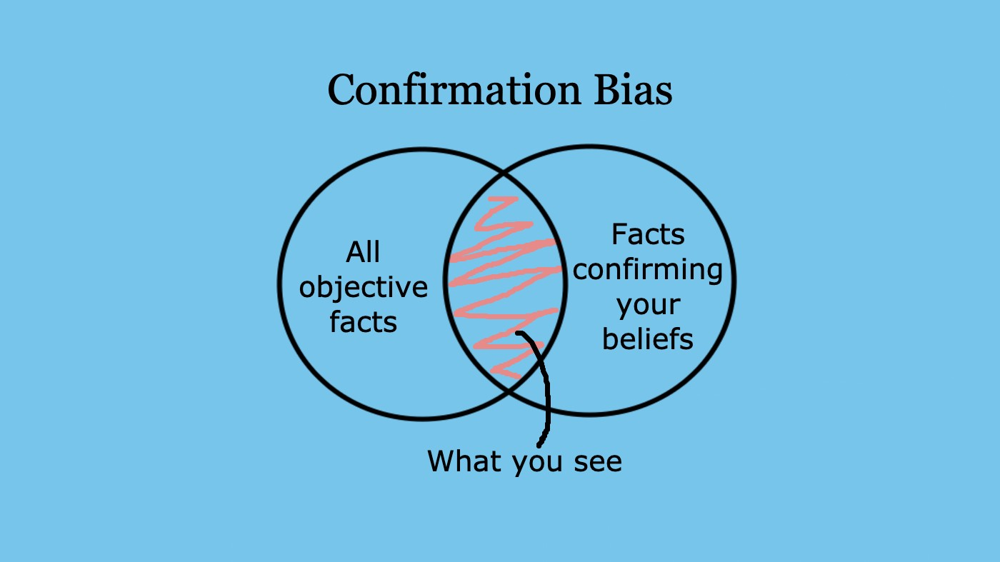
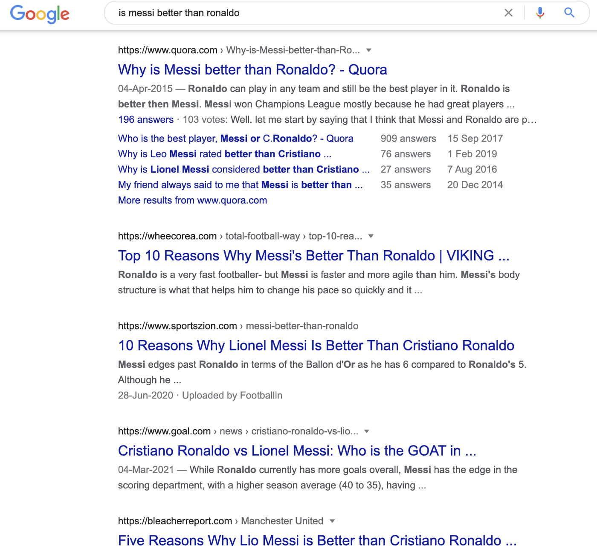
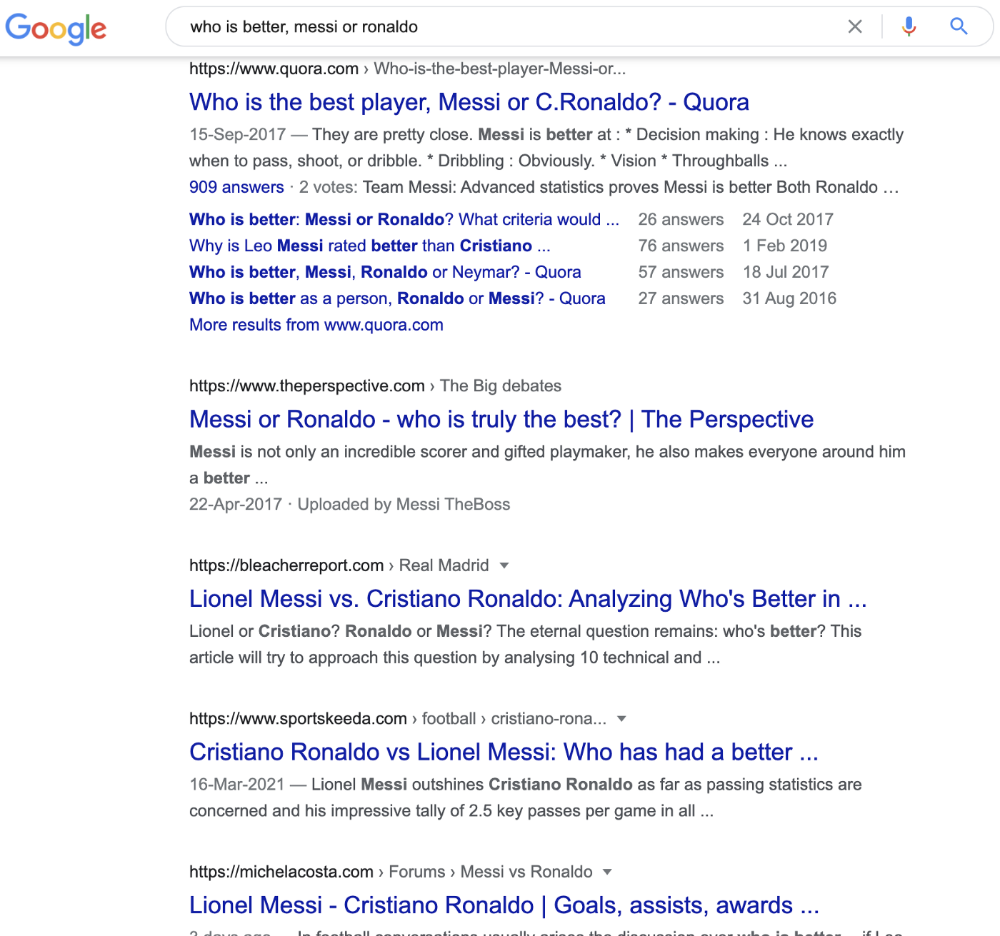
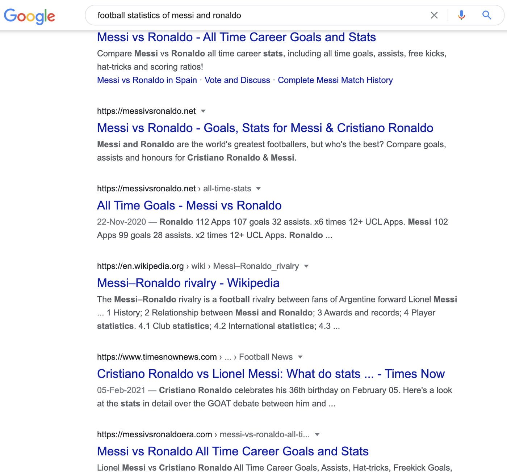

## Cognitive Biases

Cognitive Biases are a set of unwritten guidelines that nudge us to make decisions and take actions. They reduce our mental or intellectual effort to process information and make rational choices. We generally follow them without our awareness and in total submission. We follow them as they reduce our cognitive overload.

We, very commonly, fall into the trap of these biases as they are easy to follow, reduce the stress and efforts to decide and take an action. Our brain is wired to process information only when necessary. It wants to off-load as much of its work as possible and go into the ‘chill zone’ as soon and as often as possible. It doesn’t want to be disturbed. It wants to be left alone!

Hence, we form some heuristics with which we process information without troubling the brain very much and very often.

## Confirmation Bias

One such heuristic, one such bias, is the Confirmation Bias. Let me give you a situation.

In fact, go through this situation and think about what would you do in such a situation. Don’t lie to yourself — more likely than not, you are biased ;)

Ok, let’s see.

You are part of your school WhatsApp group. The group, which was formed 4 years ago, is moderately active. Members generally post birthday or anniversary wishes, news on current affairs, some memes and jokes.

One fine day, a discussion starts on Football. You don’t watch much Football and are just aware of only a few famous leagues and players. The discussion picks up heat, and some of your friends are madly debating about who is the best: **Messi or Ronaldo!**

You go away for an hour and when you come back, you see **937 unread** messages. You go berserk. Stunned by this madness, you like to figure out who is the best yourself! And you have the greatest resort one can have to aid you in this endeavour, **the all-knowing master of the universe: Google!**

So, if you had to ask Google to find out who is actually ‘The Best’, what would you type? What would you search for?

Now, pause for a moment and think.

No, really, pause and think. What is the phrase that you’d search in Google?

**I am serious. Pause and think!**

Ok, did you think? Ready now?
Fine.

Before reading further, write the phrase you’d search for in the comments below (or write it down somewhere) so that you have proof and you can lock it down. We will come back to it in a moment.

You can continue reading after you comment. Trust me, it will be fun.

Done commenting?

Ok. Now that you’ve decided what you’d search for, let’s see the possibilities. I have written some possible searches and their results:

1. is messi better than ronaldo
2. is ronaldo better than messi
3. why is messi better than ronaldo
4. why is ronaldo better than messi
5. who is better, messi or ronaldo
6. who is the best between messi and ronaldo
7. football statistics of messi and ronaldo

Of course, there could be many other combinations, but let us look at these.

**Based on the order in which you read those articles, you form some initial opinion about Messi and Ronaldo.** You start to subscribe to what you read. And as each subsequent fact reinforces the previously read facts, your belief in it strengthens. Once you read a good number of articles (could just be 2 or 3), you will form a very strong opinion about each player.

**Options 1, 2, 3, 4:**\
Please go through the below Google results carefully…

Clearly, as you can see, these results are already biased towards one player (Messi) than the other! **Google filters out articles for you that tend to argue that Messi is better than Ronaldo!** And as you read one article after the other, the reinforcement (the confirmation of your beliefs) happens, you tend to subscribe to one school of thought. So, if you search ‘is messi better than ronaldo’, you are more likely to end up in the ‘Messi Clan’ than the ‘Ronaldo Clan’ as you read more articles that favour Messi over Ronaldo.

And once you end up in that clan, you do not question your allegiance at all! Would you? I mean, according to you, you have searched by all fairness and Google is CLEARLY saying that Messi is better than Ronaldo. And you wouldn’t doubt the ‘all-knowing master’, would you? Hence you are right! Or, so you think!

Well, a while ago, you did not have any connection with Football. You do not watch much of Football and do not have much knowledge about the players and probably have a piece of very poor knowledge about what’s happening in the Football world. Yet, here you are, almost convinced that Messi is better than Ronaldo.

Similar will be the search results for options 2, 3, and 4 — and you tend to form a strong opinion on either Messi or Ronaldo based on those articles.

**Options 5, 6:**\
Please read these results carefully now…

On the other hand, searches 5 and 6 are not targeted to either Messi or Ronaldo and they give a set of partially unbiased results. Yet, these results are someone’s opinions about both the players. So, if the author of those articles is partially biased towards any player, that would reflect in the article as well.

**Option 7:**\

The search results for 7 give statistics about the players. **They give details about the number of matches, goals, awards, possession time, win % etc.** These will help you do an easy number-by-number comparison. However, comparing different kinds of numbers is also not easy. I mean, it is not possible to compare the number of goals to the ball possession time or the number of assists or the number of awards etc. Also, if you know a little about Football, you will know that the game is not just about numbers, after all!

## How to actually compare then?
If you really wanted to make such a comparison, you’d have to watch 100s of Football matches, read through 100s of player stats and study the hardships each player faced in their life among other things. And the best answer you could probably arrive at is that the comparison itself is futile! Each of them is ‘best’ in their own way… Or if you had to conclude, you’d be very specific and categorical in your answer instead of giving a generic statement like ‘Messi is better than Ronaldo’. **Because the harder question people forget to ask here is what does ‘better’ actually mean?**

And, who really wants to go through this gruelling process of analysing the information in such an impartial way just to decide who is a better player, right! Instead, we tend to spend some time going through various videos and articles on the internet and form our own opinion as soon as possible.

Unfortunately, it is not just for discussions like these but also for many important decisions in our life that we ignore such thinking. We do not want to burden ourselves so much in our daily decision making. **We off-load as much thinking as possible and spend our mental energy only in certain situations — typically the office work!**

**This kind of confirmation bias happens all the time:**
* Religious affiliations: Is Hinduism better than Christianity
* Political affiliations: Is Biden better than Trump
* National Affairs: Is the farm bill bad for the farmers
* Fanbases: Is Marvel better than DC
* Diet plans: Is Vegan better than Keto
* Global warming is not real
* Covid vaccines do not work

**The list is endless!**

As we are no experts in certain situations, we rely on the views or opinions of others on the subject and seek answers. However, rather than looking for answers, **we should question what we are looking for!** Sadly, that kind of questioning requires a lot of rationality and our mind is super lazy to do that! The mind would rather know the answer ready-made than actually probe further. It would take the answer on the face of it than question the correctness of the question itself!

>So, Confirmation Bias, basically, reinforces your already existing notions, beliefs, opinions, views, and expectations about anything. This helps us assess a situation faster, make decisions quickly and take necessary actions immediately. With that, we can spend our ‘mental energy’ on things that actually matter to us.

This happens because our mind doesn’t like to be questioned. It doesn’t want to be challenged. It doesn’t want to lose. It wants to win. It wants to be satisfied. The moment it finds that what it thinks is true, it becomes happy and reinforces that thought and tends to relax without any effort to validate it further. It requires an extra push to take the next step and validate further and we don’t want to give that extra push!

On the other hand, if it finds out anything contrary to the existing beliefs and expectations, it denies, resists, becomes restless and unhappy. And the mind tries very hard to avoid such situations and the easy way to do that is to comply with anything that reinforces the existing beliefs without questioning further.

So, the next time, when you think you are sure of something, that you are not biased in what you are saying and that you make total sense… **Think again!**

---

**Thank you for reading! 🙏🏼**

👍🏼 ➡️ If you liked it, please share it with others who might find it interesting!

**💬 Also, please leave your comment or feedback below.**

---