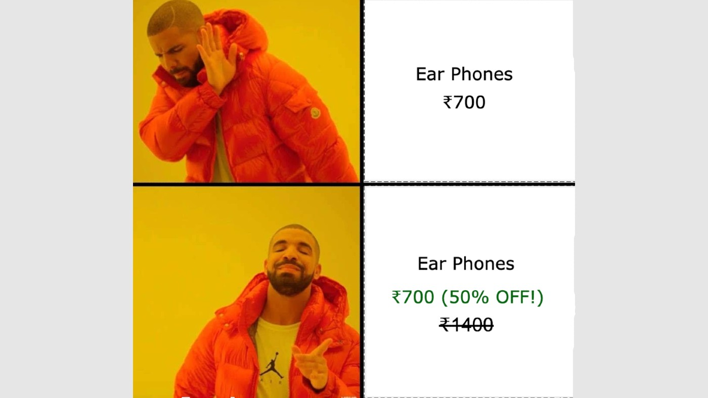
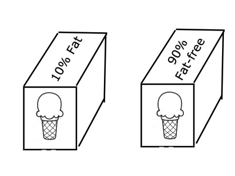

👋🏼 Hello! Thank you for stopping by.

😀 Please note that this is the fifth in a series of articles I am writing on Cognitive Biases. If you haven’t read the other four yet, I’d recommend you read them first. **Links below:**

1. [Confirmation Bias](/p/confirmation-bias) ✅
2. [Fundamental Attribution Error](/p/fundamental-attribution-error) ✅
3. [Ikea effect](/p/ikea-effect) ✅
4. [Availability Heuristic](/p/availability-heuristic) ✅
---

Ok, let’s get started with this one.

## Dwapar Yug, Dronacharya and the elephant
Mahabharata, the epic tale between the two groups of cousins, the Kauravas and the Pandavas, is a tale of a multitude of human desires, emotions and grit and vengeance. Many of its learnings are used in management, leadership and growth. Let’s start with one such small chronicle from this hell of a tale.

Without going into details, let me try and drive the point.

It is the time of the Kurukshetra War. After the death of Bheeshmacharya, Dronacharya becomes the commander-in-chief of the Kaurava army. Krishna knew that Dronacharya was formidable and with him in charge, it was impossible to defeat the Kauravas.

The only way to remove Dronacharya was to convince him that his son, Ashwathama, was dead. With his son gone, Dronacharya would give up and he could only then be killed. Krishna, the greatest trickster, devises a plan.

Ashwathama, who was considered one of the greatest warriors, was not easy to kill. Hence the trick!

As per Krishna’s plan, Bheema kills an elephant named Ashwathama after which Yudhisthir declares, ‘Ashwathama hatha (loudly), iti narova kunjarova (whispers)’. Dronacharya who heard this was able to gather only the first half of the sentence, and with Yudhisthir, who was the epitome of Dharma (righteousness), declaring such an event, Dronacharya believed it to be true and gave up himself in the war field, and was then taken down!

This, for me, is a classic case of the framing effect. Dronacharya placed enormous trust in Yudhisthir and believed that Yudhisthir would never make a false statement and when Yudhisthir called out that Ashwathama was dead, he instantaneously believed it. In fact, Yudhisthir did not make any false statement either, did he? It was just presented in a way that seemed so. It was cleverly designed (by Krishna) to ensure that it was interpreted in the way it was intended to.

That is how **the framing effect** works. It is not the information, but the way it is presented that does the trick. The trick here is to ‘frame’ someone.

This sounds too pre-historic, eh? Worry not, from the *Dwapar Yug* to the *Kali Yug*, the framing effect shines bright.

## Kali Yug and the age of (mis)information
Look at some statements below.

1. India has vaccinated only 3.1% of its population, a meagre number compared to the 41% vaccination rate in the US
2. The number of vaccine doses given in India stands at 20.7Cr, a whopping 61% of the US population!

Or read how some similar yet strikingly different headlines would create extreme views in a readers mind:
1. A staggering 20% of the Indian population is still reeling under the below poverty line (BPL)
2. Positive signs for India as the population under BPL has seen a gradual decline from 40% in 2004 to 20% in 2015

---

1. India continues its slump at the Olympics. Wins only 1 bronze
2. India creates history. Karnam Malleswari becomes the first Indian woman to win an Olympic medal

---

1. Out of 4, India is the worst team
2. Indian team is the 4th best team in the world!

---

Interesting examples, but sound too far-fetched. How do they relate to me, hmmm?\
Hold on!

**Do you go well with memes?**

Seems familiar? Been in that situation? I’d bet you did!

## The classic tale of discount marketing
You are drawn to the discount ‘%’ more than the price itself. The discount % is perceived as saving, as a benefit. And the mind is tricked into believing that you are actually in for a good deal. **A 50% off deal cannot be bad, right?**

This trick is used in a myriad number of ways. Let’s see.

A shoe store displays 40% off. You get lured, you enter the store and try different shoes. However, you notice that the 40% off is only on a few shoes displayed at the corner, as part of the clearance sale, not on all the shoes. But having entered the store already you are reluctant to leave now. And inside the store, the sales agents are ready to entice you more, serve you more and make you feel like their hero. And you try more shoes. The chances are you end up buying a different shoe than what you anticipated when you entered. Happened with you?

**Another example.**

Two ice-cream boxes containing the same ingredients display their contents differently. The first box says ‘10% fat’, the second box says ‘90% fat-free!’. It is highly likely that, given a chance, you would choose the second box more often than the first one.

Other variants of the discount displays include ‘up to 60% off’, ’50% off, offer ends tonight’, ’20% cashback’, ’60% off up to ₹50’ (this is the most ridiculous of all). They all make you feel bad for NOT using them; you may not realise that, but they do! And you want to avoid this ‘bad’ feeling and allow ourselves to be ‘framed’.

## Framing Effect
>We often draw different conclusions from the same information depending on how it is presented.

The framing effect perhaps is one of the most common tricks used by marketers, politicians, news agencies, influencers and not to forget — magicians. As the name itself says, it ‘frames’ the audience into believing what they see (or hear as it was in Dronacharya’s case), depending on how the information is presented. And based on the way information is presented, we draw different conclusions from it — to support a party or not, to buy a shoe or not, to trust a person or not — we do it almost all the time. You could draw a completely wrong conclusion and only realise it much later or not realise it at all! You could have drawn an entirely different conclusion had the information been presented in any different way.

### Politicians and the art of framing
Some more examples 😀

1. The government will glorify the fact that it was able to pave way for a cashless economy due to demonetization but will hide the fact that the currency in circulation, according to the RBI data, was ₹24.2 lakh crore in 2020 compared to ₹16.4 lakh crore in 2016. And also cover it under the rugs that as per the RBI data, about 99% of the invalidated money was returned to the banks. Remember flushing out black money was a prime objective of demonetization? But the government will never bring them to light themselves.
2. The government will call for caution, solidarity and brotherhood among fellow people during these tough Covid times, but will underplay misgovernance and systemic failure at the topmost level.

I can go on and on with various examples about how clever our people are in framing things and playing it so subtly that you don’t even realise.

### What am I trying to say, anyway?
Anyway, coming to the point. The information you consume, from the people you know, from advertisements, from strangers on social media, from newspapers or any other media — they all bear a very high power to influence us. It can sway us away from one view to another extreme view, merely by the way information is presented.

People tend to present information that suits their narrative, in a way that doesn’t harm them but helps them. It is natural. It stems from the need for self-protection and preservation. People don’t give away their shortcomings as easily as they glorify their virtues.

In fact, the onus of identifying the shortcomings (or all the facts) is on the other person. This is prevalent in almost everything you do — purchasing a car, downloading an App, ordering food, looking for a match on matrimony, voting in an election, selecting an insurance plan — the list is endless.

In fact, ‘Caveat Emptor’, a Latin phrase, which can be loosely translated into English as ‘let the buyers beware’ is a law in commercial transactions. It places the onus on the buyer to perform due diligence before making a purchase and doesn’t necessarily hold the seller responsible for not disclosing everything — for a simple reason that it is impossible to state ‘everything’ about a product/service. For example, if you want to buy a car from me, I may NOT be able to give the entire history of the car, if it had any accident, how many times was the car taken for servicing, if the windshield is in perfect condition etc. It is your responsibility to check everything that you need to know before you make the payment. By law, the onus is on you while making a purchase.

And this rule, if not law, can be extended beyond commercial transactions. While consuming information, the onus is on the receiver to get the complete information. There always will be grey areas in the information presented and you need to be careful while you draw conclusions from the information presented as it is.

This happens all the time — from making new friends to planning a trip, from finding a partner to buying a new house, from choosing a college to starting a company. It is better to take a step back and look at the information from an objective eye by asking more questions and asking for more information. This is difficult and cannot be done all the time. But if not paid enough attention, this could take you for a ride.

---

**Thank you for reading! 🙏🏼**

👍🏼 ➡️ If you liked it, please share it with others who might find it interesting!

**💬 Also, please leave your comment or feedback below.**

---