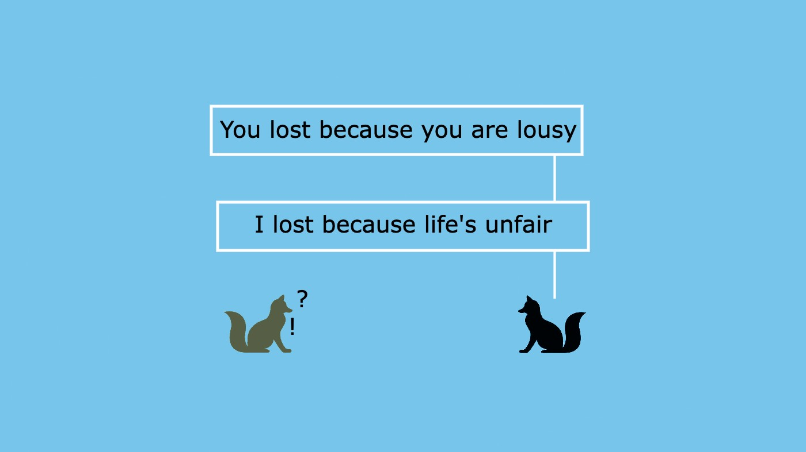
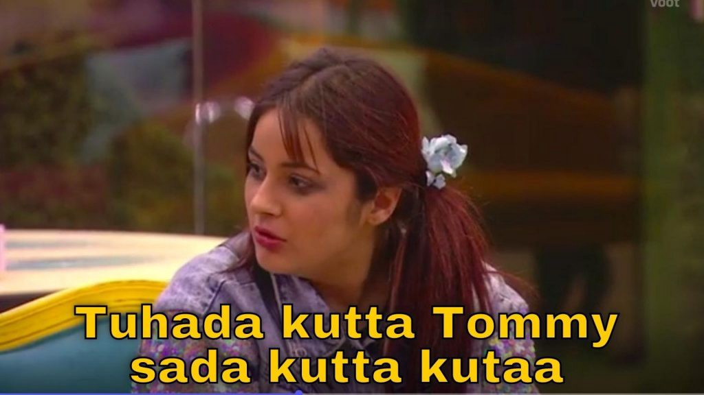

👋🏼 Hello! Thank you for stopping by.

Please note that this is the second in a series of articles I am writing on Cognitive Biases. If you haven’t read the first article yet, I’d recommend you read that first 😀. **Link below:**
1. [Confirmation Bias](/p/confirmation-bias) ✅

---
## Fundamental Attribution Error
>The Fundamental Attribution Error basically says that we judge others based on their personality and fundamental character, but judge ourselves based on our situation and circumstances.

To explain this, I am going to take a rather filmy route. Please bear with me as I get into quite a few details of these film stories to drive home the point. If you are into movies, you’d enjoy it, I believe. Even otherwise, cut me some slack, would you?

Okay, let’s get started.

## Section 375
Let’s look at the story of the movie Section 375. If you have watched it already, you’d be able to relate better, but for others, I’ve tried to lay the plot briefly below to give you enough context.

The movie is a very well written courtroom drama with Tarun Saluja (Akshaye Khanna) as the defence lawyer, Hiral Gandhi (Richa Chadda) as the prosecutor arguing rape charges filed by the victim Anjali Dangle (Meera Chopra) against Rohan Khurana (Rahul Bhatt).

Rohan, a successful Bollywood director and Anjali, a budding costume designer hoping to build a successful career in the industry, get along well in showbiz. Anjali bags a couple of big projects working under Rohan and is optimistic of a bright future.

Their relationship, however, turns into an affair and when things do not turn out well between the two is when the plot thickens. And it is unfortunate and absolutely miserable to see people in influential position misuse their power to personal whims and fancies.

Long story short, one thing leads to another and Rohan (who is already married to Kainaaz Khurana) ends the affair suddenly and withdraws Anjali from all the ongoing projects. From working on a few big projects and making a name for herself in the industry to losing everything instantly, reality hits Anjali hard. She realises this, apologises to Rohan and goes back to him to avoid any further lost opportunities. Taking advantage of his position, Rohan calls her to his residence and yet again, tries to exploit her of the situation, assaults her and forces her into having sex. Anjali couldn’t stand it any further, it was the end of the line for her.

So, as it happens, Anjali files a case against Rohan for rape and sexual assault. She presses charges and gains the media and public support overnight!

The rest of the case is discussed in a highly engaging courtroom drama. One thing I particularly like about this movie is how fine the dialogues are written and how the director, Ajay Bahl, explores a very controversial and uncomfortable territory.

With this backdrop and before discussing the movie any further, let’s look at a few things very objectively.

* Is Rohan a nice guy? Absolutely not.
* Did Rohan have a history of misbehaviour? Yes.
* Did Anjali have an affair with Rohan, knowing he is married? Yes.
* Did Anjali have consensual sex with Rohan before the rape incident? Yes.
* Does having a bad past make the accused guilty of current charges? No.
* Do we have strong proof of rape? Not rape, but marks of physical abuse and sex. And a confession by Anjali.
* Did Anjali have a blemishless history to take her word as gospel? No.

So, as you can see — the case stands on a knife’s edge. And in cases like these, the victim’s confession against the accused is sufficient to pronounce him guilty. And the court will decide that based on the facts, the evidence and the victim’s statement, which will be the final judgement and that is fine! And that’s exactly how a judgement is passed — after a thorough and unbiased examination of the facts and evidence, not from hearsay and definitely not because some section of the public thinks so.

**So, what has this story got to do with Fundamental Attribution Error, you wonder?**

The reason I gave this entire backdrop is to show the relevance and importance of context and facts before a judgement is passed about anything or anyone. And the ‘Fundamental Attribution Error’ I would like to refer to in this story is that made by the media and the public, **people like you and me. People like us.**

In this case, the defence lawyer, Tarun, was seen by the media and the public as the villain for defending the accused. In fact, even Hiral Gandhi, the prosecutor (who herself was Tarun’s student) was surprised at Tarun’s lack of awareness. She wondered how Tarun was not able to see things that clearly portrayed Rohan guilty and was surprised at how hard he was trying to defend Rohan of rape charges!

The media and public outrage are understandable — they are disgusted with such pathetic behaviour of men across industries, strata, and geographies. But are they right in calling the accused guilty already? Because people knew Rohan’s past and his character, they judged him based on his past and his character than the facts. And they believed it and could have bet their life on it. They believed they were right, no matter what the actual truth was. They knew that Rohan was a sick person, and hence must be the culprit.

But, is that the truth? Did their judgement stand on a strong ground? Were they prone to the fundamental attribution error? I guess so.

As it happens in the end, Anjali confesses to Hiral Gandhi that it was not rape. Anjali couldn’t digest the fact that she got those projects, not because of her talent and skills but because Rohan did her a favour by spending time with him. She felt like a whore, and was hurt. She wanted to take revenge. Cleverly, and with vengeance, she made a case for herself.

---

I would have stretched the explanation by quite a bit on a very sensitive topic, you think. But let me tell you, it is prevalent in many and very mundane real-life situations as well. But before going there, let me tell you another story.

## Chak De! India
Remember Kabir Khan from Chak De! India?

The movie opens with the final between India and Pakistan in the World Hockey Championship. Pakistan is leading 2–1. With 2 minutes to go India desperately need a goal. And luckily for India, they get a penalty shot. It is highly unlikely to not score a goal on a penalty shot. So, all the Indians, the team management, the entire team and the captain Kabir Khan — all are very hopeful of the goal.

Kabir Khan takes the shot and as the drama unfolds, he misses it! India loses the final!

The entire country is disappointed at the loss. The public outrage is palpable. The media accuses Kabir Khan of the loss. With a few pictures of Kabir Khan with the Pakistan players, it questions his patriotism. The question catches heat and in no time the public actually declares him as a traitor. A traitor who gave away the win to Pakistan. Kabir Khan’s neighbourhood disowned him. He and his family were forced to vacate and move to a new place.

But why? How did the public come to that conclusion?

Let’s look at what happened.
* Do India-Pakistan matches carry an extra dose of emotions? *Hell, yes!*
* Did India lose the match against Pakistan? *Yes, happens in sports.*
* Was there a possibility that the loss was just circumstantial? Definitely. *You can’t control everything that happens in a hockey match!*
* People were outraged by the loss. *Yes, understandable.*
* The loss was attributed to Kabir Khan. *Yes, understandable. He was the captain, after all.*
* Did Kabir Khan deliberately lose the match? *No!*
* Kabir Khan was a Muslim. *This shouldn’t matter, but it did for the public.*
* Being a Muslim is attributed as favouritism to Pakistan. *I guess this is a stretch, but again the public attributed it whatsoever!*
* Displaying sportsmanship by shaking hands is attributed as anti-national. *The public had taken it too far here.*

Well, it may seem alright that people were outraged and furious about the loss and this kind of accusation could just have been an outpour of emotions. This, right here, is a Fundamental Attribution Error. When you look at it again, people were strongly carried away by their emotions because of the loss and believed that the loss was only because of Kabir Khan. Unfortunately, in that flurry of emotions, they took it too far, they declared him anti-national on the mere basis that he was a Muslim.

**All this filmy Gyan is OK! Does this happen in real life too?**

We make this kind of attribution errors in our life too! We jump to conclusions and judge others based on our prior notion, opinion and perception about them. If someone does something, we do not critically assess the situation and pass our judgement based on our preconceived notions in the spur of the moment. Though we think we are very rational, we are driven by emotions most of the time.

Let me give you some examples. Real-ones this time :)

## Performance appraisals!
Do you feel that you are not being recognised? That your performance rating and salary hike is not as per your expectations despite working really hard and giving all you got because your boss is an idiot? But your colleague is well promoted and treated nicely because she maintains good terms with her manager despite not being very talented and hard-working as you are?

Do you blame your poor performance on your boss but your colleague’s better rating on her character?

I am not sure about you, but I certainly did. In one of my previous companies, I did not get the hike I expected, I blamed my poor performance on the market and my manager for not recognizing my efforts. I, in fact, was convinced that only those who are in the close network of the manager got the benefits, not all! I blamed my inability to perform on my circumstances and my manager.

Fast forward a few years, I now know that I was wrong! I know that I was naive. That growth requires effort and it can’t just merely be circumstantial. Now I don’t take others’ growth for granted just like mine!

I mean, we wear different lens when we judge others and different (self-fulfilling) lens when we judge ourselves.

I get reminded of this meme, ‘tumhara kutta tommy, hamara kutta kutta?’ — says how self-serving we are, how we judge others to suit our convenience!

We favour our own people and disregard others. If we make some mistake, we blame it on the situation. But if the same mistake is made by others, we somehow know for a fact that it is because of their inability, their personality and their carelessness. We care less about the role of circumstances and situations in the case of others than in our own.

I mean, we are not ready to cut someone some slack because of their past choices and past mistakes. We carry their past all through our life and use it to judge them. And judge them as per our convenience, to fit our narrative.

**Sounds strange? Let’s look at some more examples…**
* If someone fails an entrance exam, you say ‘he’s not capable.’ But, if you fail in the exam, the narrative changes to ‘I had a fever, I couldn’t study.’
* If someone is good at sketching, ‘he’s just talented.’ And why don’t you sketch? ‘you know I don’t have time to practice.’
* If a colleague takes a leave because he’s sick, you already know he is lying. But when you fall sick and skip work, nobody should blame you.
* If someone loses money in stocks, ‘she’s such a bad investor.’ But if you lose money in stocks, ‘the market crashed!’
* If someone did not get selected for a job, ‘he was not qualified in the first place.’ But if you did not get selected, ‘the interviewer asked tough questions.’
* If someone loses a game, ‘she was unfit, she shouldn’t have been selected.’ But if you lose a business deal, ‘they did not understand the benefits of our product.’

We also pass judgements based on mere appearances and personalities:
* A candidate is not well organized and well planned because he is wearing a wrinkled shirt in an interview.
* A girl is a slut because she is wearing a skirt.
* A girl is inviting you for sex because she is talking to you with a smile.
* Someone is lazy just because he is fat.

These judgements might be true in some cases. But they are most certainly NOT true all the time. We form these judgments because our mind is in a rush and our experience says that these are true most of the time.

The world is chaotic and we are trying to figure out our way through all this chaos. It’s like cracking a code or solving a puzzle. It appears very random at first, but as we solve it we see patterns and realise that we can crack the code by following those patterns.

Similarly, in life too, we are trying to find patterns around us — the way people talk, the way they eat, the way they commute, the way they dress, the way they treat others etc. And when we see a pattern, it gets registered in our mind. We use these patterns subsequently to navigate through the chaos and make choices quickly. That, however, doesn’t mean that the patterns hold good all the time. There could be and there will be deviations in the patterns. And in life, we should embrace these deviations.

**We must be cognizant of the fact that our judgements could be wrong and think twice before we judge or comment on others.**

---

**Thank you for reading! 🙏🏼**

👍🏼 ➡️ If you liked it, please share it with others who might find it interesting!

**💬 Also, please leave your comment or feedback below.**

---