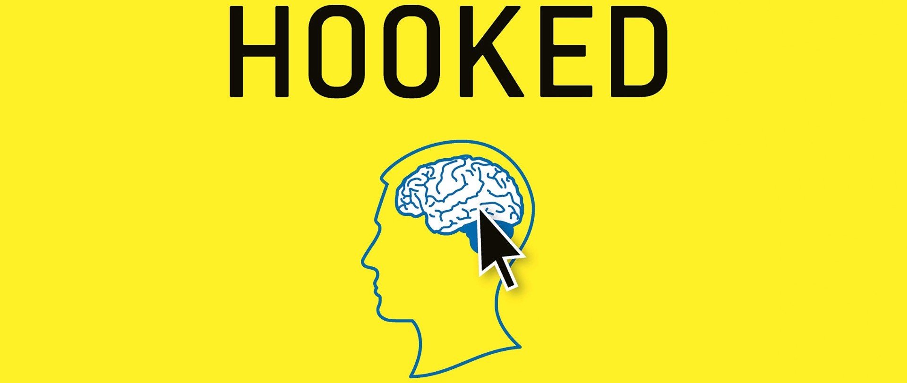
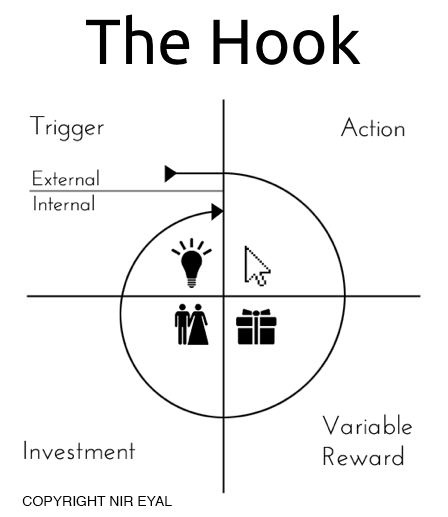

Hooked is one of those books which I would recommend to every aspiring Product Manager. In fact, anyone who is even sparsely connected with human psychology or behaviour should read this. It is a short, quick read and insightful with some clever real-world examples.

While reading the book, I had collated some important and wow moments in my notepad. I wanted to share them with others and thus this article. Please note that this in no way is the gist of the book! These are just some cool observations I made while reading the book and there could be plenty other cool observations I would have missed. So, I strongly recommend you to read the book than reading this article (yes, I am trying to sabotage myself here! — anything for a good read, right?).

Now that you have decided to read this article, let’s do it…
The title of the book ‘Hooked’ is indicative of the user behaviour while using some of the current digital products. Products like Facebook, Instagram, TikTok, Spotify, Netflix and plenty others have quite literally hooked their users to use the product again and again. The author, **Nir Eyal**, explores the reason for this addictive behaviour and simply presents his findings with some cool real-life examples.

Nir Eyal analyses the user behaviour with the help of ‘The Hook Model’ — a habit-forming cycle of Trigger — Action — Variable Reward — Investment. It is this cycle that transforms behaviour into a routine and a habit. It is this cycle that helps us either make or break any habit. (This was described by **James Clear** in his book ‘Atomic Habits’ as well. Atomic Habits is another fantastic read if you are interested.)

In the Trigger phase, you are prompted by some trigger— either external or internal. This could be some information or a text message or a notification or a sound or an emotion or a memory from the past.
##### Example: A Facebook notification: ‘Sanjay and 5 others have commented on your post’

Next, in the Action phase, you take an action as a response to that trigger — something as small as replying to someone or as big as purchasing a house.
##### Example: You like Sanjay’s comment

The third step is about ‘Rewards’. All human actions inherently expect rewards and you take actions in anticipation of rewards. Nir Eyal uses ‘variable rewards’ and not just ‘rewards’ here. This is because you are more likely to form a habit because of the variable component of the reward than the reward itself. I will discuss this in detail later.
##### Example: You expect more people to like and comment. And also expect Sanjay to like or comment on your next post as well.

The last step in the Hook Model is Investment and it is critical for building habits. You can think of this as an investment of your resource: time or money or emotion etc. The more you invest your resources into a product, the more you value it and more likely are you to go back to it again. In other words, your perceived value of a product increases as you spend more time on it.

If you think about it, all these ‘addictive’ products try to keep you glued to them for as long as possible! And you tend to go back to using the product again with the slightest of a trigger because you have already invested much of your time or money or emotion into it, you want to see how that investment has shaped.
##### Example: As you liked Sanjay’s comment, you are drawn to another post by a mutual friend of yours and Sanjay’s. You click that, and bang — you enter the world of infinite scroll and auto-play videos. And before you notice, you have already spent the last 25min watching an uncle dance, some babies giggle and cats do funny faces.

**But why is this happening?**

### Let’s look deeper into the Hook Model:

#### Triggers
There are two kinds of triggers for taking any action: **external and internal.**

**External Triggers:**
External Triggers are those which are caused by an external stimulus, by some outside force or outside substance. Businesses use different types of external triggers prompting a user to take action :\
* **Paid trigger.** Example: Spotify’s advertises for its new video podcasts. This makes you curious to check that out because you know that Spotify is a music streaming application and this advertisement about video podcasts surprises you
* **Earned trigger.** A typical PR or a media mention. Example: Elon Musk’s tweet about Signal: ‘Use Signal’ caused mass hysteria and many started to use Signal after that
* **Relationship trigger.** Example: Your friend tells you about how cool the new ‘FaceApp’ is and you feel like trying it once
Owned trigger. A typical subscription, like that of a newsletter or a club membership, or an App icon on the phone. Example: You subscribed to Medium and open it once a week as Medium sends you an email about a new viral article every week. Or you frequently open WhatsApp on your phone just because the App icon is visible to you on your home screen. Owned triggers increase the repeat engagement of the user. Without owned triggers, it is difficult to form a habit.

**Internal Triggers:**
Human emotions are the internal triggers that prompt the user to take an action. More often than not, negative emotions drive the user to spontaneously take an action than positive emotions.
* **Negative Emotions:** boredom, fear, loneliness, frustration, confusion
* **Positive Emotions:** happiness, motivation, compassion

##### Example: Now and then when you feel like you are bored, you tend to open Facebook or Youtube just to check what’s going on, without any external trigger.

*New habits are sparked by external triggers, but the associations with internal triggers are what keeps them hooked to the product. Designers take special care in ensuring that internal triggers are taken care in the user journey with the product.*

#### Rewards

Rewards create a dopamine surge in the brain. Dopamine, often referred to as the pleasure hormone, plays a vital role in how we feel. It helps us strive, focus and find things interesting. Higher the dopamine surge, higher the pleasure. As dopamine gets released, we surpass the brain’s decision and judgement areas and activate the parts associated with want and desire. So, if dopamine is released by doing some action then that action is directly associated with our wants and desires. And because of this association we want to do that action again in anticipation of the reward.

And introducing variability in rewards simply multiplies this effect. In addition, variability in rewards activates the nucleus accumbens region in our brain and spikes the levels of the neurotransmitter Dopamine, driving our hungry search for rewards further.

Most of the products use this rewarding mechanism to keep the users glued. There three types of variable rewards which Product Designers incorporate in their designs: Reward bythe Tribe, Reward by the Hunt, Reward by the Self

**Tribe:** We look for rewards in the form of social recognition or acceptance from our tribe, from those who are like us. We are more likely to alter our behaviours and beliefs if we see others who are more like ourselves being rewarded.
##### Example: Likes and comments on Facebook, upvotes and badges on Stackoverflow
**Hunt:** Variable reward which is given after the completion of a task.
##### Example: The outcome on the gambling machine after spinning it, total points accumulated after playing a round of Candy Crush
**Self:** This is a very personal form of gratification. These are fueled by intrinsic motivation
##### Example: You feel happy about 3 kills in PUBG today compared to only 1 kill yesterday

Companies spend a lot of time and effort in designing the perfect model of variable rewards. Variable rewards are not some magic fairy dust to sprinkle on the products, they are carefully designed considering why a particular user uses a product and what kind of variable reward aligns with the user’s internal triggers and motivations.

This brings us to the last step in the Hook Model: **Investments**

#### Investments

The above variable rewards combined with the investment of user’s time and effort into the product makes the user come back to the product again and again.

The reasons why we tend to go back to the product again and again:
* We tend to value things more which we’ve created/put in our efforts
* We tend to repeat our past behaviours

We tend to go back to the same product again and again because we have already invested our time or money or effort or emotions into it. The idea behind the investment phase is to leverage a user’s belief that the service will get better over time with further use and personal investment.

Some examples of different investments users make:
* Content: Youtube, TikTok, Facebook
* Data: Linkedin
* Knowledge: Medium, Substack
* Emotions: Instagram Stories
* Money: Netflix Premium, Spotify Premium

It is pretty much this habit-forming cycle of Trigger-Action-Variable Reward-Investment that keeps us hooked to a particular product and makes us go back to it again and again.

---

In the rest of the article, you can find some related heuristics about this habit-forming cycle. In no particular order, I have provided some insights drawn in bits and pieces from the book: some experiments, theories and anecdotes related to this topic.

### Fogg’s Model for human behaviour:**
According to Fogg’s model, any user behaviour depends on three things:
* User’s motivation to do
* User’s ability to do
* User’s trigger to do

In fact, Fogg represents this by equation B = MAT. So, the behaviour is a product of Motivation, Ability and Trigger. If any of these is not present or is insufficient then the user will not cross the line to take an action and thus not form a habit.

**Motivation:**\
Three Core Motivators in human beings:
* Seek pleasure and avoid pain
* Seek hope and avoid fear
* Seek social acceptance and avoid rejection

**Ability:**\
The factors that influence the ability to do a task are time, money, physical effort, mental effort, social acceptance, non-routineness of a task. It is found that the product designers focus on easing the scarciest resource at the moment of deciding to do a task or not.

Influencing behaviour by reducing the effort required to act is more effective than increasing someone’s desire to do it.

##### Example: You will find that the ‘Buy Now’ button on Amazon will be of same colour, shape and design across the website. This is to reduce the mental effort by the user to process what that button means. You need to process it only once, when you visit Amazon for the first time. Every other time, you know what that button means and hence you are eased of that mental effort.

**Trigger:**\
I discussed Triggers earlier in this article.

### Other Common Heuristics
There are some common heuristics which businesses typically make use of to trigger behaviours. As we see below, these heuristics are designed so that people make split-second decisions every day and yet remain unaware of how they are influenced in making those decisions.

**The scarcity effect:**\
People associate more value to the things that are scarce. A study by Worchel, Lee, and Adewole showed that the perceived value of scarcer items was more than the items in abundance, though the items were the same.
##### Example: This effect is used by online retailers like Amazon: ‘Only 14 items in the stock.’

Another cool point in this context is that the perceived value increases as the product once abundant gradually becomes scarce.
##### Example: This is seen in Tele Shopping where products are sold on TV. In this, the product advertised will start with ‘Qty: 1000 available’ and the number is gradually reduced. As the number reduces from 1000 to 700 to 500, the viewers attach more value to the product and tend to place the order.

**The Anchoring Effect:**
We get transfixed to something that is shown to us directly. We tend to believe it to be true on instinct and do not notice other things happening around us or question other things — we are too lazy to pay attention or question our instincts.
##### Example: You walk into a shopping mall and see the ‘50% Off’ signboard and instinctively go towards that. You rarely question what that 50% Off actually means. In most cases, 50% Off is given as part of a clearance sale on old products or on some other products which you wouldn’t otherwise purchase. The idea here is to get your foot in the door. Once there, the shopkeeper will try and sell other ‘costly’ products to you.

**The Endowed Progress Effect:**
People tend to put more effort to reach a goal if they believe that they have made progress or are making progress towards that goal. It is a phenomenon that increases motivation as people believe that they can achieve the goal.
##### Example: To make more people update their profile, Linkedin uses the profile strength progress bar. As you notice that your profile is only 50% complete, you intrinsically yearn to fill in more details and hit a higher number on the progress bar.

**The Framing Effect:**\
The environment in which a product or value is delivered affects the way the value is perceived.
##### Example: A musician playing in a paid concert will be valued more compared to the same musician playing in a subway for free. Another example, the same wine from a bottle tagged $1,000 will taste better than that from a bottle tagged $100!

Read more about the **Framing effect** [here.](/p/framing-effect)

**Note** that some of the examples I mentioned above are not from the book but are my personal examples.

This brings to the end of the article. Hope you liked it!

---

**Thank you for reading! 🙏🏼**

👍🏼 ➡️ If you liked it, please share it with others who might find it interesting!

**💬 Also, please leave your comment or feedback below.**

---