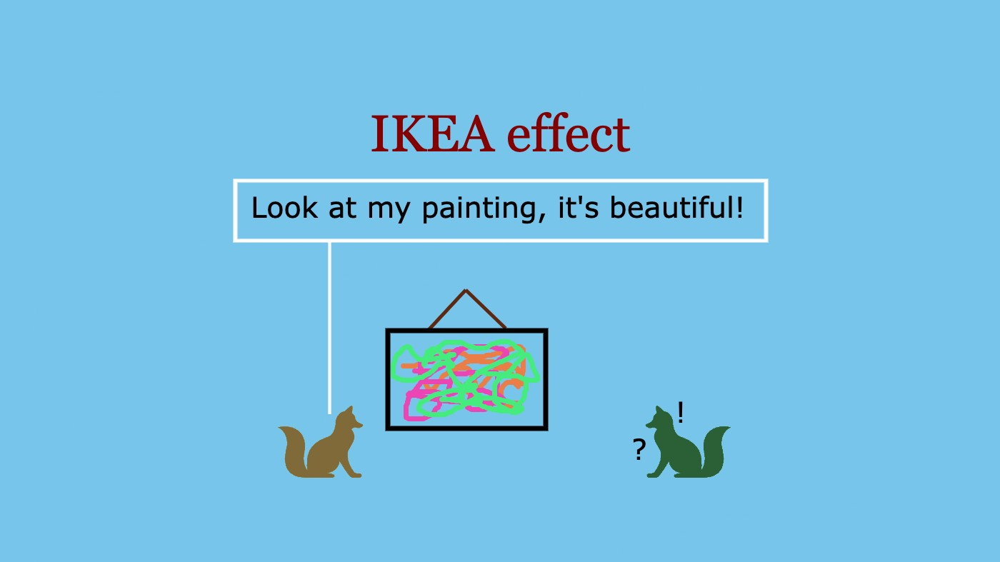

👋🏼 Hello! Thank you for stopping by.

😀 Please note that this is the third in a series of articles I am writing on Cognitive Biases. If you haven’t read the other two yet, I’d recommend you read them first. **Links below:**

1. [Confirmation Bias](/p/confirmation-bias) ✅
2. [Fundamental Attribution Error](/p/fundamental-attribution-error) ✅

---

Ok, let’s get started with this one.

## 🚀 WhatsDplan

In 2015, **[Ramesh Kumar Katreddi](https://www.linkedin.com/in/rameshkatreddi/)** and I started **[WhatsDplan](https://www.linkedin.com/company/whatsdplan)**. We had deliberated quite a lot on the product we wanted to build and out of the numerous ideas we had, we narrowed it down to one and started building it. We had quit our jobs and laboured day and night to build the best product we could.

We were building an event planning application for friends. We loved the idea from the beginning and we thought that the product we were building would be loved by everyone around, used by many and would be an instant hit. As naive as it may sound, I did think that WhatsDplan was a breakthrough product! I mean why would anyone not like such a beautiful product, right!

As it turned out, I was wrong. People did not use it as much as I thought they would. In fact, people did not use it at all! There were hardly any repeat users and the number of users dipped day by day. I was gutted and there was nothing I could do about it. My heart sank and I felt devastated. I still hoped that something miraculous would happen for people to realise its value. And, of course, nothing miraculous happened!

We started working on the App idea because we loved it and put our heart, blood and sweat into developing it. If you ask any startup founder you will get the same answer. But, does that mean that others also would value our product as much as we do? Most of the time, the answer is no. It was only much later that I realised that our App did not provide much value to the users and they did not like it as much as we did.

I realised that for the things I create, people do not assign the same amount of value as I do. In fact, I realised I assign a disproportionately high amount of value to the things that I create, but others don’t.

Not just me, you too are the greatest lover of your work, aren’t you? You too would have a thing or two in your closet that you value a lot, right? A childhood sketch maybe? Or a painting or a hand-written note or the prizes you’d won! Don’t you value them so much? You don’t realise, but you probably value them very highly! More so, if you are an artist, you are likely to value your video or a song or a film or a poem or even a piece of quote/tagline more highly than your friends’ who do similar work!

But why do we attach so much value to things we create? There’s a reason.

## 🎇 The IKEA effect
>The IKEA effect simply says that we place a higher value on things we partially created ourselves.

One of the many Cognitive Biases, the IKEA effect draws its name from the world-famous Swedish furniture company, IKEA.

At IKEA, you don’t always get a fully assembled product. In many cases, you get parts of the furniture in boxes and you assemble them yourself. And as it happens, because you are assembling your furniture, you assign more value to it and hence are more likely to go back to IKEA again than any other furniture store. Pretty smart, eh!

The word ‘IKEA effect’ was first coined by Michael Nortan, Daniel Mochon and Dan Ariely in their 2012 paper titled ‘IKEA effect: When labour leads to love.’ The paper opens with a famous ‘instant cake mixes’ story from the 1950s.

Long story short, when the instant cake mixes were introduced into the market, they did not perform well. The sales did not pick up. When the manufacturers studied the reasons for why such a good product was not picking up, they found that the instant cake mixes took away the need to ‘put in the effort’ to make cakes at home. They made the housewives think that it made cooking too easy and they did not value them as much. By removing the need for effort and labour, the cake mixes de-valued themselves instead of improving the value. So, later, when the manufacturers re-launched them by introducing an extra step where the housewives had to add an egg into the mix before baking, they gained popularity and it was a hit!

We, as humans, have the psychological need to feel competent, that we are capable of doing something and can learn and overcome obstacles. We don’t like to be seen as incompetent or foolish. This could be linked to the time when a man’s survival depended on his competence and his ability — to hunt and to safeguard himself and his family. Not just for survival, but also for his status, his power and improving his chances of mating — they all demanded his competency. This is true even to this day.

Another reason why the IKEA effect happens is ‘Effort Justification’. When we work hard for something, we tend to believe that all our effort was for a good reason, that there was a purpose which we were working towards. And no matter what the outcome, we place more value on it because we worked hard for a good reason in the first place. We think we are rational and want to justify that all that time and effort are not mere wastes! So, we convince ourselves that our ‘thing’ is more valuable than others.

When we create something, we not only feel good at the moment, but it also fulfils a deep psychological need. We derive happiness and the feeling of happiness gets etched in our memory. And when we create something, we find it to be more valuable than it is because of this extra dose of happiness it gives us.

## 📑 Some examples
Think about it, which one would you value more: a greeting card with a long personal note you wrote yourself or a greeting card that has a well-written thank you note by a professional? You likely value the card with your personal message more than the other although the message on the professional card is better in every way — in terms of content, emotions, grammar and presentation!

Another example, if you haven’t already, bake a cake! I bet you’d value it more than the most delicious cake from the best bakery in the world!

Not just in personal lives, it happens at our workplace too. You spend a lot of time in research, deliberate a lot and propose an idea to a problem. You instantly fall in love with the idea — no matter how bad or impractical it is. You think that it is great and is worth giving a shot.

Or you work hard and execute a project to completion. You think that it is worthy of the ‘best project’ award. However, it baffles you when your manager doesn’t give you any recognition!

## 🤔 Is that wrong?
You might say, of course, you value things more because of your emotional attachment with them because you created them and only you know how hard you worked for it. And this is good. Valuing things is good. Because you value things, you take care of them, you ensure their longevity and nurture them if required. This leads to a more caring, loving and sustainable world — a better place to live, after all!

However, if your biased decision-making affects others’ lives then there is a problem. This cannot be ignored. That would not make the world just. As a society, we need to consider others’ interests as well to make it a better place.

## 📑More examples
Consider an example, a politician is adamant about not revoking a policy just because he spent many months creating it although the policy is irrelevant in the present day and is affecting millions of people.
Or your manager who doesn’t change an existing process because she had spent innumerable hours devising the process a couple of years ago and works just fine even today, or so she thinks! However, it is you and your team who are facing the brunt of it.

Or you work the whole night analysing the market and arrive at some conclusive finding to improve your company revenue. However, in the morning you find some evidence which renders your findings inconclusive. Yet, you go ahead and discuss the actionable based on your analysis from the night.

Or as a manager, when you have an option to choose between your work and your subordinate’s, you disregard the work by your subordinate even though you know deep down that her work is better than yours!

Sounds unfair, right? It is! And we all are party to it, thanks to our lazy and self-obsessed mind.

## 💎 So, how to avoid this?
I could think of a few ways, you can add more in the comments!

**🩺 Take a second opinion**\
When you are deeply engrossed in your creation you do not realise its disadvantages. You tend to think that all is good and get blindsided. So, it is always good to take a second opinion, run it with others and be open for feedback. In most cases, you are not an expert in the area you are working on, so it is always better to be open to expert opinions and other ideas as well.\
**For example**, if you made a new Sales deck, run it by your colleagues and ask for feedback. Don’t assume that it is the best deck on the planet.

**❤️ Think from a third-person’s point of view**\
Thinking from someone else’s point of view is not easy. It needs a lot of empathy and empathy is not developed overnight. But, with experience and by talking to more and more people you will have it. And once you have it, it is only a question of whether or not you are willing to make that extra effort to put yourself in the other person’s shoe.\
**For example**, if you prepared a plan for your kids for the summer vacation, try and get a grasp of what they think of it. Do they like it too?

**🧐 Read the environment**
And when people do not directly give you the feedback or share how they feel, you need to go out of your way to see how they are responding. Watch out for signs yourself. Do they really like it too or is it just your belief? Is your work affecting them in any adverse way? Is there anything you could do to make things better?\
**For example**, if you launched a new leave policy at the workplace, listen to the chatter around. Listen to what the employees are saying about it. Are there any changes you should do to the policy?

**⛔ Be ready to accept failure**
All your efforts won’t be fruitful. All your creations won’t be great. You must accept that. Most of your works fail. And from failures, you learn. Only when you accept the fact that your work is not great is when you strive to create something remarkable. And when you strive for something truly remarkable — you usually end up doing that!\
**Eg.:** Well, no examples for this one! 😜

---

**Thank you for reading! 🙏🏼**

👍🏼 ➡️ If you liked it, please share it with others who might find it interesting!

**💬 Also, please leave your comment or feedback below.**

---