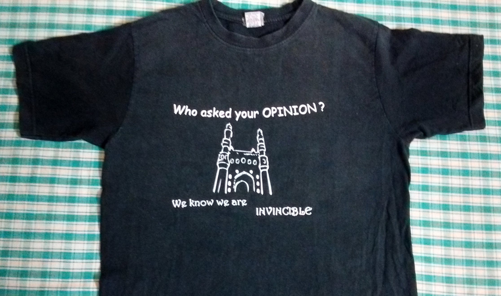

When the exam results are out, your heart would skip a beat. It is natural to get anxious and you would get restless until you check the result. You quickly open the computer, search Google and get a list of websites. You will most probably click three or four links, thanks to Google. Any delay will add to those small moments of anxiety. What goes through your mind?  How do you feel when you type your hall ticket number and the page starts loading? What if the website is slow and is takes longer than usual to display your result?

This is one of those moments when all you can do is just **wait**... for a few seconds or may be a minute, till you get to see your result. And you will finally get back to normalcy. Phew! Imagine if this phase is extended to an hour... two hours... a day or two! You may smash the computer screen! As you are able to read this, I guess you would have had your share of those stimulating hours of uncertainty, that anxiety, at some time or the other... during cricket/football matches, distribution of test papers in class, placement results, dance competition results, while on the way to catch a train etc... Just think!

.

.

.

When in NIT Warangal, we had to organize the Freshers Event. It was our second year, and we were organizing it for the first time. We planned to get our batch T-Shirts printed and give it as Freshers gift. The T-Shirt design was ready and I was not sure of how to get it printed. The printer asked for .cdr format but we had .psd format ONLY - for the obvious reason that it was easy to get. Time was running out and the printer asked for a minimum of 15 days to print and deliver the shirts. We had allocated our budget for T-Shirts and everything was planned accordingly. So there was no going back and we had to find our way out. We ran down all the options: searched DC++ for the software, read stuff online and asked many seniors. **Given the time, There was only one way out...**

I still remember that night - I sat in our final year students' hostel verandah, waiting. I got a senior's contact and was waiting for him. He was, then, the go-to-guy for T-Shirts in our college. I did not meet him before and he, obviously, did not know me. I wasn't sure if he would help us, he sounded very reluctant on the phone. There was a little hope and  I was sitting there, waiting for him. I waited for about two hours and that felt like hell. I couldn't do anything else, but to wait. When I got restless I went to his room, for about 4 or 5 times only to find it locked. I had already bugged him by calling so many times that I did not take any chance to call him again. I read the hostel notice board, just to seem busy and avoid myself getting bullied by other seniors. The 'guy' had come, finally! He saw me sitting on the bench and reluctantly asked for my pen drive.

We went into his room, a typical B.Tech. final year student's room... you wouldn't know if a cloth on the floor was a towel or a door-mat! Anyway, he opened the file and checked the design. First thing he uttered: "*Kya hai yaar ye... itne saare* layers and some are not even proper... *Main merge bhi nahi kar sakta.*" ("What's this, dude? There are so many layers and some are not even proper. I can't even merge them.")

It was my first Photoshop design to go for printing, so there was no way for it to be professional! I had to quietly nod to whatever he said. "Abhi nahi hoga, it will take time." - "I can't do it now, it will take time." But, it had to be sent to the printer without any further delay! I requested him... pleaded him... begged him - *bas pau pakadna baaki tha!* and he finally agreed to be awake and do it.

I was sitting behind him, quietly listening to his comments on how bad the file was and his suggestions for me. He did some rework on a few layers, added a few more layers and took the design into Corel Draw - saved it in .cdr format and gave it to me. Such a relief!! I was jubilant, felt like jumping and shouting! I thanked him and ran to my hostel, sent the file to the printer and Done! Wow!

Now, during that phase, when there was no other option than to just wait and do nothing, I felt like my head will burst. "Let's chuck the T-Shirts, we can give some other gift" - this thought occurred a hundred times. I wanted to fast forward time, to the next day and get away from that feeling. But, when the shirts arrived, just a day before the event, everyone was excited about them and there was JOY - when you see that in others... believe me, all your efforts are paid!

**In the hindsight, when I think about it again... that time which I waited is in fact the most I cherish**. Had I not waited, we would have never got the shirts done. My friend still has one of those shirts with him which he still wears. I hope our juniors also might still have it. It's a simple white print on a black cotton shirt.

Pic here... it's quite old now: 13 years! (as of 2021)

---

So, whenever you think that you cannot push it anymore, remind yourself that **you've come this far only to go further, not breakdown!**

YOU CAN DO IT!

---